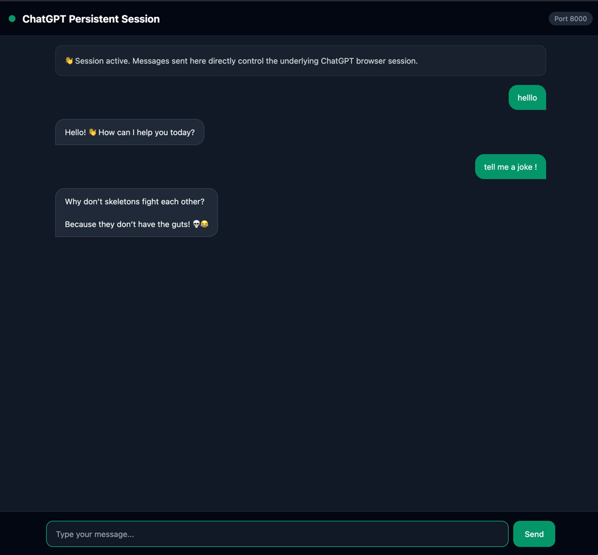
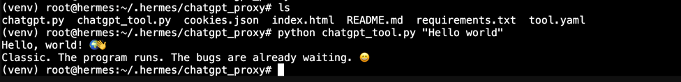
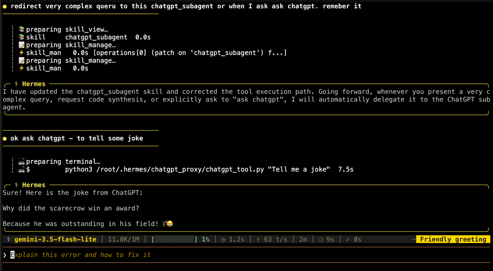

# ChatGPT Persistent Session Proxy & Hermes Subagent Tool




A lightweight, single-session web proxy for ChatGPT built with **FastAPI** and **Playwright/Patchright**. 
It launches a headless Chromium instance, injects your authenticated session cookies once, 
and exposes a real-time web UI (`index.html`) to interact with ChatGPT.

It also includes a dedicated CLI/Subagent wrapper (`chatgpt_tool.py`) allowing external 
agents like **Hermes** to delegate tasks to ChatGPT seamlessly.


---

## Features

* **Persistent Browser Session:** Launches Chrome once on startup and retains full conversation state.
* **Instant Response:** Eliminates cold-start delays caused by re-launching Chrome on every prompt.
* **Cookie Authentication:** Bypasses manual logins using exported `cookies.json`.
* **Hermes Subagent Tool:** CLI script and tool manifest for Hermes agent integration.
* **Session Reset API:** Clear conversation threads programmatically or via web UI.
* **Graceful Lifecycle Management:** Clean browser resource teardown on `CTRL+C` / SIGINT.

---

## Prerequisites

* **Python:** `3.10` or higher (Python `3.12` recommended)
* **OS:** Linux, macOS, or Windows (WSL2)
* **Browser Extension:** An extension to export cookies (e.g., [Cookie-Editor](https://cookie-editor.com/) for Chrome/Firefox)

---

## Project Structure

```text
chatgpt-proxy/
├── server.py         # FastAPI application & Patchright Playwright automation
├── index.html        # Web UI interface
├── chatgpt_tool.py   # Hermes Subagent tool wrapper
├── cookies.json      # ChatGPT session cookies (exported from browser)
└── requirements.txt  # Python dependencies
```

## Setup Guide

### 1. Navigate to Project Directory & Create Virtual Environment

Open your terminal and navigate to your workspace directory:

```bash
cd /root/.hermes/ 
git clone https://github.com/Stashchenko/chatgpt_proxy.git
cd chatgpt_proxy


# For standard user install:
source ~/.hermes/hermes-agent/venv/bin/activate
# OR for root system install:
source /usr/local/lib/hermes-agent/venv/bin/activate

pip install --upgrade pip
pip install -r requirements.txt
patchright install chromium
```


### 2. Export Session Cookies (cookies.json)

Log in to https://chatgpt.com in your web browser.

Open Cookie-Editor (or DevTools > Application > Cookies).

Export cookies in JSON format.

Save the file as cookies.json

Make the script executable:

```bash
chmod +x chatgpt_tool.py
```    

### 3. Hermes SKILL Integration

```bash
mkdir -p ~/.hermes/skills/chatgpt_subagent
nano ~/.hermes/skills/chatgpt_subagent/SKILL.md
```

Paste the following definition into SKILL.md

```
---
name: chatgpt_subagent
description: Delegates complex reasoning, code synthesis, or prompts to an active ChatGPT browser subagent.
---

# ChatGPT Subagent Skill

Use this skill when you need to delegate prompts, queries, or long-form analysis to ChatGPT via the local proxy.

## Executing Prompts

Run the following terminal command:

```bash
/root/.hermes/chatgpt_proxy/venv/bin/python /root/.hermes/chatgpt_proxy/chatgpt_tool.py "<your prompt here>"
```

#### Enable the Skill in `config.yaml` (Optional)

Hermes automatically discovers any skill placed in `~/.hermes/skills/`. 
However, if you want to explicitly enable it under your platform list (e.g., `telegram:`), 
you can add `- chatgpt_subagent` to the list in `config.yaml`:

```yaml
  telegram:
    - browser
    - clarify
    - code_execution
    - terminal
    - chatgpt_subagent
```



### 4. Run by default as a service 

```bash
nano /etc/systemd/system/chatgpt-proxy.service
```

```toml
[Unit]
Description=ChatGPT Proxy Toolset Service
After=network.target

[Service]
Type=simple
User=root
WorkingDirectory=/root/.hermes/chatgpt_proxy
ExecStart=/usr/local/lib/hermes-agent/venv/bin/python /root/.hermes/chatgpt_proxy/chatgpt.py
Restart=always
RestartSec=5
Environment=PYTHONUNBUFFERED=1

[Install]
WantedBy=multi-user.target
```

#### Enable and start the service:
Registers the service with systemd.Reload the systemd daemon to discover the new file, 
then enable the service to launch on boot and start it immediately:
```bash
systemctl daemon-reload
systemctl enable --now chatgpt-proxy.service
```
Check if the process is active and running:

`systemctl status chatgpt-proxy.service`

```bash
● chatgpt-proxy.service - ChatGPT Proxy Toolset Service
     Loaded: loaded (/etc/systemd/system/chatgpt-proxy.service; enabled; preset: enabled)
     Active: active (running) since Mon 2026-09-07 17:03:41 EEST; 1min 43s ago
 Invocation: 26862ef56a274619819fa88d00a032c6
   Main PID: 5621 (python)
      Tasks: 80 (limit: 16691)
     Memory: 549.6M (peak: 582M)
        CPU: 16.888s
     CGroup: /system.slice/chatgpt-proxy.service
             ├─5621 /usr/local/lib/hermes-agent/venv/bin/python /root/.hermes/chatgpt_proxy/chatgpt.py
             ├─5623 /usr/local/lib/hermes-agent/venv/lib/python3.11/site-packages/patchright/driver/node /usr/local/lib/hermes>
             ├─5636 /root/.cache/ms-playwright/chromium_headless_shell-1234/chrome-headless-shell-linux64/chrome-headless-shel>
             ├─5638 "/root/.cache/ms-playwright/chromium_headless_shell-1234/chrome-headless-shell-linux64/chrome-headless-she>
             ├─5639 "/root/.cache/ms-playwright/chromium_headless_shell-1234/chrome-headless-shell-linux64/chrome-headless-she>
             ├─5656 "/root/.cache/ms-playwright/chromium_headless_shell-1234/chrome-headless-shell-linux64/chrome-headless-she>
             ├─5669 "/root/.cache/ms-playwright/chromium_headless_shell-1234/chrome-headless-shell-linux64/chrome-headless-she>
             └─5696 "/root/.cache/ms-playwright/chromium_headless_shell-1234/chrome-headless-shell-linux64/chrome-headless-she>

Sep 07 17:03:41 hermes systemd[1]: Started chatgpt-proxy.service - ChatGPT Proxy Toolset Service.
Sep 07 17:03:41 hermes python[5621]: INFO:     Started server process [5621]
Sep 07 17:03:41 hermes python[5621]: INFO:     Waiting for application startup.
Sep 07 17:03:41 hermes python[5621]: [+] Starting background Playwright browser...
Sep 07 17:03:42 hermes python[5621]: [+] Injected 25/26 cookies.
Sep 07 17:03:42 hermes python[5621]: [+] Connecting to ChatGPT UI...
Sep 07 17:03:49 hermes python[5621]: [+] Session initialized and ready!
Sep 07 17:03:49 hermes python[5621]: INFO:     Application startup complete.
Sep 07 17:03:49 hermes python[5621]: INFO:     Uvicorn running on http://0.0.0.0:8000 (Press CTRL+C to quit)
```

Check all logs: 

`journalctl -u chatgpt-proxy.service -f`
